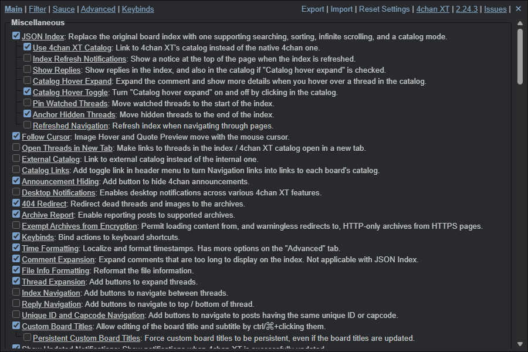
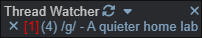
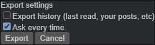

# 4chan XT


A searchable thread catalog with filters and a thread watcher for supported imageboards.

**This is a preservation fork.** [Upstream development ended on December 23, 2025](https://github.com/TuxedoTako/4chan-xt). This copy preserves the existing interface and adds a checked Manifest V3 package with clearer setup instructions. It isn't an upstream relaunch, and it doesn't promise current compatibility with every board.

[Download v2.24.3](https://github.com/SysAdminDoc/4chan-xt/releases/tag/v2.24.3) · [Install instructions](#install) · [Changes](CHANGELOG.md)



The actual extension, captured in isolated Chromium with the Tomorrow theme. The surrounding board and posts use fictional offline data. No live posts, uploads or media downloads were used for this review.

## What it does

| Task | Where to start |
| --- | --- |
| Find a discussion | Search the catalog, sort by reply count, or reverse the order. |
| Keep a thread handy | Use its heart button, then open **Thread Watcher** in the header. |
| Hide posts that don't interest you | Open **Settings → Filter** and choose a field. Rules use regular expressions. |
| Keep your preferences | Use **Export** and **Import** in Settings. Review the privacy notes below before sharing an export. |



There are also inherited tools for quote previews, archive lookups, media handling and quick replies. Those integrations depend on third-party sites. This release doesn't claim that posting, CAPTCHA, external archives or media conversion were tested end to end.

## Install

Choose **one** installation method. Running the userscript and extension together, or alongside another 4chan X copy, can cause conflicts. Export your existing settings before changing installations.

### Chromium extension

1. Download [the Manifest V3 ZIP](https://github.com/SysAdminDoc/4chan-xt/releases/download/v2.24.3/4chan-XT-v2.24.3-chromium.zip).
2. Extract it into a permanent folder. Keep that folder after installation.
3. Open your browser's Extensions page and enable **Developer mode**.
4. Select **Load unpacked** and choose the extracted folder containing `manifest.json`.

The ZIP is the installable extension, not GitHub's automatic source archive. Its default manifest is already V3; don't rename files or try to load the old V2 manifest. [Chrome has removed Manifest V2 support](https://developer.chrome.com/docs/extensions/develop/migrate/mv2-deprecation-timeline).

Unpacked extensions don't update automatically. Close supported board tabs, replace the files in the same folder with a new release, click **Reload** on the Extensions page, and reopen the tabs. Changing folders can change an unpacked extension's identity and leave its saved settings behind.

No signed CRX or Firefox XPI is supplied. The original signing identity isn't available in this checkout, and this fork doesn't claim an upstream store listing.

### Userscript

Install a compatible manager such as [Violentmonkey](https://violentmonkey.github.io/get-it/) first. Then open the readable [4chan-XT.user.js](https://raw.githubusercontent.com/SysAdminDoc/4chan-xt/project-XT/builds/4chan-XT.user.js) in the manager, review its permissions, and install it. A downloaded copy is also included in the release.

Unlike upstream's final release, this fork's update metadata points to **SysAdminDoc/4chan-xt**. Your manager controls update checks. You can disable automatic updates in that manager if you prefer to review each version. There's no promise of a future release schedule.

The namespace is unchanged from 4chan XT. Installing this copy may replace an existing XT userscript. Keep your settings backup; 4chan X uses a different namespace.

## Privacy and removal

4chan XT isn't an anonymity or security tool. It can store the last post you read and which posts are yours, including during private browsing. Turn off **Remember Last Read Post** and **Remember Your Posts** if you don't want that history retained.

**Exports include history by default.** Clear **Export history** in the export dialog to leave out watched threads, last-read positions and related history. The file can still contain personal preferences, filter rules and saved values. Don't upload a full settings file to a public issue or paste site.



The userscript requests broad cross-origin access for inherited integrations. The extension requests access to its supported sites and can ask for additional origins. Archive lookups, link titles and embedded media may send requests to external services. Review [the inherited privacy guide](https://github.com/ccd0/4chan-x/wiki/Privacy) and turn off features you don't need. Their providers' terms and privacy policies still apply.

After uninstalling XT, the site's native extension may still be disabled. Open the site's own **Settings**, clear **Disable the native extension**, then save the site's settings.

## Build and verification

Development requires Node.js 22 or newer and npm. Clone this repository, then run:

```sh
npm ci
npm run build:release
```

The release command cleans only known generated artifacts, rebuilds the userscript and reloadable extension, runs the local tests, then verifies every ZIP entry against its source. Packages and SHA-256 checksums are written to `dist/`.

For regular development, use `npm run build` or `npm run build:crx`. `npm run build:userscript` builds only the userscript. The existing `-test` build option includes upstream's interactive browser checks.

**The TypeScript migration is unfinished.** The baseline and reviewed extension build each report 576 distinct TypeScript diagnostics, printed twice across the main script and worker builds (1,152 messages). A successful bundle is not a clean typecheck. See [the roadmap](ROADMAP.md) for the remaining work.

The local review exercised search, sorting, watched threads, saved filters and history-excluding exports on fictional data in the installed Chromium extension and in Violentmonkey 2.48.0. Both installation methods passed 20 local behavior checks each. See [verification notes](assets/marketing/VERIFICATION.md) for evidence and limits. Firefox, Tampermonkey, live posting and third-party services aren't covered by those checks.

## History and support

This fork descends from [TuxedoTako's 4chan XT](https://github.com/TuxedoTako/4chan-xt), a TypeScript/JavaScript migration of [ccd0's 4chan X](https://github.com/ccd0/4chan-x). Earlier work by aeosynth, Mayhem, ihavenoface, Zixaphir, Seaweed and Spittie remains credited in the source and [MIT license](LICENSE). Neither project is affiliated with 4chan.

The inherited pixel-X icon is retained. [Original artwork and screenshot comparisons](assets/marketing/concepts/README.md) are saved with the repository, along with [unadopted identity briefs](LOGO_PROMPTS.md). No new logo has been selected.

See [contributing and troubleshooting](CONTRIBUTING.md) before reporting an issue with this copy. The archived upstream issue tracker and wikis are historical references, not active support channels.
